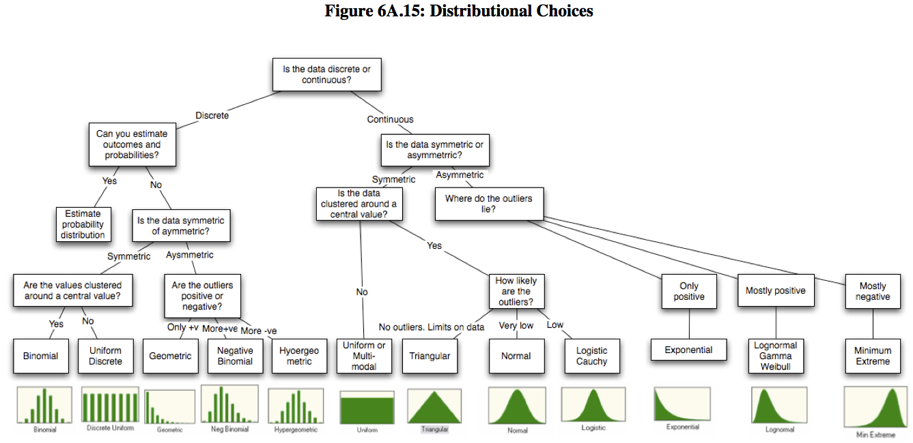
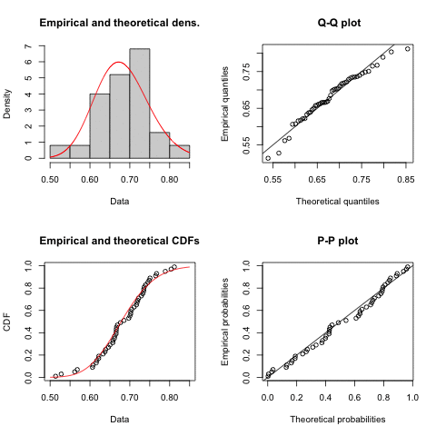
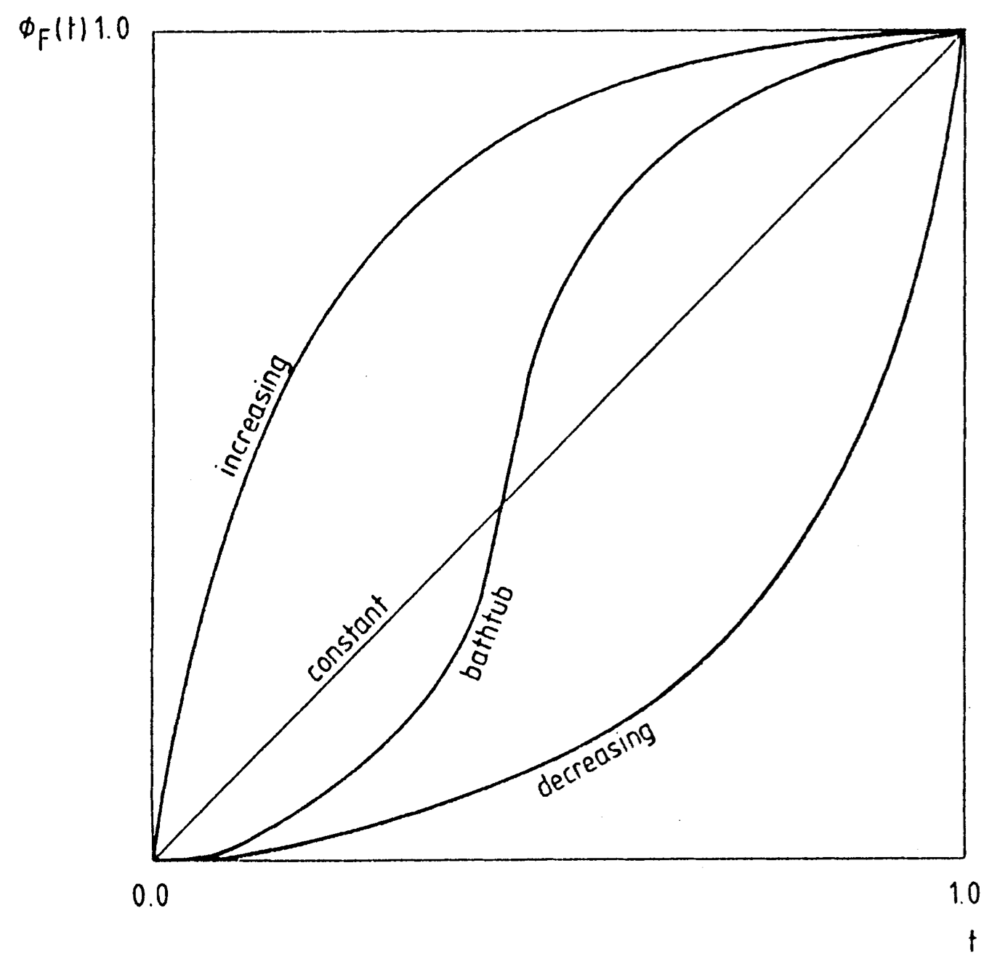

# Introduction

Let's start by creating realizations of normal laws.
```{r}
set.seed(46692)
m0 <- 1
s0 <- 0.45
mes_donnees <- rlnorm(250, mean=m0, sd=s0)
```

The historical method with R to fit a distribution is the function `MASS::fitdistr`. For example to fit a normal distribution to the previous `mes_donnees` sample.
```{r}
library(MASS)
fit <- fitdistr(mes_donnees, densfun="normal")  
fit
fit_ln <- fitdistr(mes_donnees, densfun="lognormal")  
fit_ln
fit_exp <- fitdistr(mes_donnees, densfun="exponential")  
fit_exp
fit_gamma <- fitdistr(mes_donnees, densfun="gamma")  
fit_gamma
fit_weibull <- fitdistr(mes_donnees, densfun="weibull")  
fit_weibull
fit_chisq <- fitdistr(mes_donnees, densfun="chi-squared", start=list(df=5))  
fit_chisq
```

In `MASS` the adjustment is done by
`Maximum-likelihood Fitting of Univariate Distributions`
for distributions "beta", "cauchy", "chi-squared", "exponential", "gamma", "geometric", "log-normal", "lognormal", "logistic", "negative binomial", "normal", "Poisson", "t" et "weibull".


Graphical visualization of the quality of the fit.
```{r}
hist(mes_donnees, pch=20, breaks=25, prob=TRUE, main="")
curve(dnorm(x, fit$estimate[1], fit$estimate[2]), col="blue", lwd=2, add=T)
curve(dlnorm(x, fit_ln$estimate[1], fit_ln$estimate[2]), col="red", lwd=2, add=T)
curve(dexp(x, fit_exp$estimate[1]), col="green", lwd=2, add=T)
curve(dgamma(x, fit_gamma$estimate[1], fit_gamma$estimate[2]), col="purple", lwd=2, add=T)
curve(dweibull(x, fit_weibull$estimate[1], fit_weibull$estimate[2]), col="gold", lwd=2, add=T)
curve(dchisq(x, fit_chisq$estimate[1]), col="pink", lwd=2, add=T)
if(!require("latex2exp")){install.packages("latex2exp");library(latex2exp)}
legend("topright", legend=c("Normal","LogNormal","Exp",TeX("$\\Gamma$"),"Weibull",TeX("$\\Chi^2$")), lty=1, col=c("blue","red","green","purple","gold","pink"))
```

How to optimize with R ?

* optimize -> search extremums for a function of one variable

* optim -> search extremums for a function of several variables
method = c("Nelder-Mead", "BFGS", "CG", "L-BFGS-B", "SANN", "Brent")

* In the following, "PSO" -> particle swarn optimization

$$
L(\mu;\sigma^2,x_1;\ldots,x_n) = \Pi_{i=1}^n L(\mu;\sigma^2;x_i)
$$
$$
\frac{1}{(2\pi \sigma^2)^{n/2}}\exp\left(-\frac{1}{2\sigma^2}\sum_{i=1}^n(x_i-\mu)^2\right)
$$
$$
L(\mu;\sigma^2,x_1;\ldots,x_n) = \Pi_{i=1}^n L(\mu;\sigma^2;x_i) = \Pi_{i=1}^n dnorm(x_i;\mu;\sigma)
$$
$$
\log{L}(\mu;\sigma^2,x_1;\ldots;x_n) = \sum_{i=1}^n \log{L}(\mu;\sigma^2;x_i) = \sum_{i=1}^n dnorm(x_i;\mu;\sigma;log=TRUE)
$$

`dnorm(1,m0,s0,log=TRUE)` computes the log-likelihood for $xi=1$ and the parameters $m0$ and $s0$.

```{r}
xi=1
1/sqrt(2*pi*s0^2)*exp(-1/(2*s0^2)*(xi-m0)^2)
dnorm(1,m0,s0)

log(1/sqrt(2*pi*s0^2)*exp(-1/(2*s0^2)*(xi-m0)^2))
dnorm(1,m0,s0,log=TRUE)
```

`dnorm` is a vector function i.e. it applies "by itself" to all coordinates of a vector. See ``Vectorize`'' for more details on how to create vector functions. Thus we obtain the log likelihood of the sample with normality assumption for $m_0$ and $s_0$ with this command line.

```{r}
sum(dnorm(mes_donnees,m0,s0,log=TRUE))
```
Thus we obtain the log likelihood of the sample with log-normality assumption for $m_0$ and $s_0$ with this command line.

```{r}
sum(dlnorm(mes_donnees,m0,s0,log=TRUE))
```


`fitdistr` uses `optim` to estimate the parameter values by maximizing the likelihood function. It works as follows:
```{r}
log_likelihood_norm <- function(params) { 
  -sum(dnorm(mes_donnees, params[1], params[2], log=TRUE))
  #identique à return(-sum(dnorm(mes_donnees, params[1], params[2], log=TRUE)))
  }
fit2 <- optim(c(0,1), log_likelihood_norm)    # c(0,1) sont les valeurs initiales de l'algorithme d'optimisation -> m0=0 et s0=1 -> on part du cas normal centré réduit.
fit2
fit2bis <- optim(c(mean(mes_donnees),sd(mes_donnees)), log_likelihood_norm)
fit2bis

log_likelihood_lnorm <- function(params) { 
  -sum(dlnorm(mes_donnees, params[1], params[2], log=TRUE))
  }
fit2_ln <- optim(c(0,1), log_likelihood_lnorm)
fit2bis_ln <- optim(c(mean(mes_donnees),sd(mes_donnees)), log_likelihood_lnorm)

log_likelihood_exp <- function(params) { 
  -sum(dexp(mes_donnees, params[1], log=TRUE))
  }
fit2_exp <- optim(c(1), log_likelihood_exp)  
fit2bis_exp <- optim(1/c(mean(mes_donnees)), log_likelihood_exp)

log_likelihood_gamma <- function(params) { 
  -sum(dgamma(mes_donnees, params[1], params[2], log=TRUE))
  }
fit2_gamma <- optim(c(1,1), log_likelihood_gamma) 

log_likelihood_weibull <- function(params) { 
  -sum(dweibull(mes_donnees, params[1], params[2], log=TRUE))
  }
fit2_weibull <- optim(c(1,1), log_likelihood_weibull)

log_likelihood_chisq <- function(params) { 
  -sum(dchisq(mes_donnees, params[1], log=TRUE))
  }
fit2_chisq <- optim(c(3), log_likelihood_chisq)
```

A value of 0 in the variable `convergence` indicates that the algorithm has converged successfully. 

Numerical and graphical comparison of the two fits.
```{r}
cbind(fitdistr=fit$estimate,optim=fit2$par,optim2=fit2bis$par)
```
```{r}
cbind(fitdistr=fit_ln$estimate,optim=fit2_ln$par,optim2=fit2bis_ln$par)
```

```{r}
hist(mes_donnees, pch=20, breaks=25, prob=TRUE)
curve(dnorm(x, fit2$par[1],     fit2$par[2]),     col="blue", lwd=6, lty=2, add=T) # optim fit
curve(dnorm(x, fit$estimate[1], fit$estimate[2]), col="blue",  lwd=2, lty=1, add=T) # fitdistr fit
curve(dlnorm(x, fit2_ln$par[1],     fit2_ln$par[2]),     col="red", lwd=6, lty=2, add=T) # optim fit
curve(dlnorm(x, fit_ln$estimate[1], fit_ln$estimate[2]), col="red",  lwd=2, lty=1, add=T) # fitdistr fit
curve(dexp(x, fit2_exp$par[1]),     col="green", lwd=6, lty=2, add=T) # optim fit
curve(dexp(x, fit_exp$estimate[1]), col="green",  lwd=2, lty=1, add=T) # fitdistr fit
curve(dgamma(x, fit2_gamma$par[1],     fit2_gamma$par[2]),     col="purple", lwd=6, lty=2, add=T) # optim fit
curve(dgamma(x, fit_gamma$estimate[1], fit_gamma$estimate[2]), col="purple",  lwd=2, lty=1, add=T) # fitdistr fit
curve(dweibull(x, fit2_weibull$par[1],     fit2_weibull$par[2]),     col="gold", lty=2, lwd=6, add=T) # optim fit
curve(dweibull(x, fit_weibull$estimate[1], fit_weibull$estimate[2]), col="gold", lty=1,  lwd=2, add=T) # fitdistr fit
curve(dchisq(x, fit2_chisq$par[1]),     col="pink", lty=2, lwd=6, add=T) # optim fit
curve(dchisq(x, fit_chisq$estimate[1]), col="pink", lty=1,  lwd=2, add=T) # fitdistr fit

if(!require("latex2exp")){install.packages("latex2exp");library(latex2exp)}
legend("topright", legend=c("Normal","LogNormal","Exp",TeX("$\\Gamma$"),"Weibull",TeX("$\\Chi^2$")), lty=1, col=c("blue","red","green","purple","gold","pink"))
```

In the following, we will use the `fitdistrplus` *package for fitting distributions.

```{r, message=FALSE, warning=FALSE}
if(!require("fitdistrplus")){install.packages("fitdistrplus");library(fitdistrplus)}
```

# `fitdistrplus`

```{r}
library(fitdistrplus)
```

## Choose the right distribution



The [*CRAN Task View: Probability Distributions*](https://cran.r-project.org/web/views/Distributions.html) provides an overview of the distributions available in the various R *packages supported on CRAN.

You will be particularly interested in the distributions available in the [`actuar`](https://cran.r-project.org/web/packages/actuar/vignettes/distributions.pdf) *package.


Let's use one of the data sets provided by the *package*:

```{r}
data("groundbeef", package = "fitdistrplus")
my_data <- groundbeef$serving
plot(my_data, pch=20)
```


We can first plot the empirical density and histogram to get an overview of the data:
```{r}
plotdist(my_data, histo = TRUE, demp = TRUE)
```

Representing some classical descriptive statistics, such as moments, often proves to be a relevant tool to help us make a decision:
```{r}
descdist(my_data, discrete=FALSE, boot=500)
```

The graph also represents estimates of kurtosis and skewness by a nonparametric bootstrap procedure.

## Fitting a distribution
Let's suppose, for example, that in the previous case, we chose to fit the data to weibull, gamma and lognormal distributions. To perform this adjustment, we just use the `fitdist` function.

Several methods for fitting

* maximum likelihood `mle` function

* `mme` moment matching estimation

* `qme` quantile matching estimation -> think about the way the `qqline` line is constructed.

* `mge` maximum goodness-of-fit estimation

* `mse` maximum spacing estimation.

```{r}
fit_w  <- fitdist(my_data, distr = "weibull") 
summary(fit_w)
```
```{r}
fit_g  <- fitdist(my_data, "gamma")
summary(fit_g)
```

```{r}
fit_ln <- fitdist(my_data, "lnorm")
summary(fit_ln)
```

A graphical representation of these adjustments is obtained as follows:
```{r}
par(mfrow=c(2,2))
plot.legend <- c("Weibull", "lognormal", "gamma")
denscomp(list(fit_w, fit_g, fit_ln), legendtext = plot.legend)
cdfcomp (list(fit_w, fit_g, fit_ln), legendtext = plot.legend)
qqcomp  (list(fit_w, fit_g, fit_ln), legendtext = plot.legend)
ppcomp  (list(fit_w, fit_g, fit_ln), legendtext = plot.legend)
```

The tool can work with other distributions than those provided in the basic R *packages*. In fact, it is enough that the corresponding functions, `d`, `p`, `q`, are implemented.

* d + "distr option in fitdist

* p + "distr option in fitdist

* q + "option distr in fitdist"

```{r}
dsoleil <- dnorm
psoleil <- pnorm
qsoleil <- qnorm
dsoleil
psoleil
qsoleil

fit_soleil  <- fitdist(my_data, "soleil", start=list(mean=5, sd=10))
summary(fit_soleil)
cdfcomp(fit_soleil)

detoile = function(x,sd,...) return(dnorm(x,mean=1,sd,...))
petoile = function(q,sd,...) return(pnorm(q,mean=1,sd,...))
qetoile = function(p,sd,...) return(qnorm(p,mean=1,sd,...))
detoile
petoile
qetoile

temp <- as.vector(scale(my_data))
fit_etoile  <- fitdist(temp, "etoile", start=list(sd=10))
summary(fit_etoile)
cdfcomp(fit_etoile)
```


In the following example, the endosulfan dataset cannot be properly fitted by basic distributions such as the log-normal:
```{r}
data("endosulfan", package = "fitdistrplus")
my_data <- endosulfan$ATV

fit_ln <- fitdist(my_data, "lnorm")
cdfcomp(fit_ln, xlogscale = TRUE, ylogscale = TRUE)
```


To solve this problem, let's use the Burr and Pareto distributions available in the `actuar` package

```{r}
if(!require("actuar")){install.packages("actuar");library(actuar)}

fit_ll <- fitdist(my_data, "llogis", start = list(shape = 1, scale = 500))
fit_P  <- fitdist(my_data, "pareto", start = list(shape = 1, scale = 500))
fit_B  <- fitdist(my_data, "burr",   start = list(shape1 = 0.3, shape2 = 1, rate = 1))
cdfcomp(list(fit_ln, fit_ll, fit_P, fit_B), xlogscale = TRUE, ylogscale = TRUE,
        legendtext = c("lognormal", "loglogistic", "Pareto", "Burr"))
denscomp(list(fit_ln, fit_ll, fit_P, fit_B), xlim=c(0.01,10))
```

Pareto 1 (two parameters)
$$
f(x) = \frac{a s^a}{(x + s)^{a + 1}}, x>0, a >0 \textrm{ et } s>0.
$$

Pareto 2 (three parameters)
$$
f(x) = \frac{a}{(s [1 + (x - m)/s]^{a + 1})}, x>m, m\in\mathbb{R}, a >0 \textrm{ et } s>0.
$$

Feller Pareto

The Feller-Pareto distribution of parameters $min = m$, $shape1 = a$, $shape2 = b$, $shape3 = c$ and $scale = s$, has the density
$$
f(x) = \frac{\Gamma(a + c)}{(\Gamma(a)\Gamma(c)} \frac{b ((x - m)/s)^{bc - 1}}{(s [1 + ((x - m)/s)^b]^{a + c})}, x > m, m\in\mathbb{R}, a > 0, b > 0, c > 0 \textrm{ et } s > 0.
$$

The Feller-Pareto law contains the following special cases:

* a Pareto IV law if `shape3 == 1`;

* a Pareto III law if `shape1 shape3 == 1`;

* a Pareto II law if `shape1 shape2 == 1`;

* a Pareto I law if `shape1 shape2 == 1` and `min = scale`.


### Evaluation of the goodness of fit

The problem of deciding the goodness of fit of an unknown distribution function (fdr) $F_{\theta}$ from a sample $x_1, \ldots, x_n$ is equivalent to the decision problem on an unknown parameter $\theta$. 

Let $\mathcal{F}=\{F_{\theta};\theta \in \Theta\}$ be a family of distributions, where $\Theta$ is the space of $\theta$ parameters. The *best* element $F_{theta}$ in $\mathcal{F}$ can be determined from the MLE ${hat \theta}_n$ of $\theta$. Suppose that $F_{\theta}$ exists for $\theta = {\hat \theta}_n$.

Some statistics are commonly used to check the fit of the distribution function $F_\theta$ to the observations. Alternatives to the likelihood ratio test have been proposed by [Chen G, Balakrishnan N. A general purpose approximate goodness-of-fit test. Journal of Quality Technology. 1995;27:154-161. 10.1080/00224065.1995.11979578](https://www.tandfonline.com/doi/full/10.1080/00224065.1995.11979578) by correcting the Cramér-von Mises ($W^2$) and Anderson-Darling ($A^2$) statistics. 

Let $F_n(x)$ be the empirical distribution function and $F(x;{\hat \theta}_n)$ the postulated fdr evaluated in ${hat \theta}_n$. According to [Chen and Balakrishnan, 2015](https://www.tandfonline.com/doi/full/10.1080/00224065.1995.11979578), the usual Cramér-von Mises ($W^2$) and Anderson-Darling ($A^2$) statistics can be expressed as follows:

$$
W^2=\sum_{i=1}^n\left[u_i−\frac{2i−1}{2n}\right]^2+\frac{1}{12n}
$$
et
$$
A^2=−n−\frac1n\sum_{i=1}^n\left\{(2i−1)\ln(u_i)+(2n+1−2i)\ln(1−u_i)\right\},
$$

respectively, where $u_i=\Phi((y_i-\bar y)/s_y)$ ($\Phi$ is the distribution function of the centered and reduced normal distribution), $v_i=F(x_i;{\hat \theta}_n), y_i = \Phi^{-1}(v_i)$, and $s_y$ is the square root of the corrected variance of the $y_i$ for $i = 1, \ldots, n$.

The corrected statistics $W^*$ and $A^*$ are given by 

\begin{eqnarray}
W^∗&=&{n\int_{-\infty}^{+\infty}\left\{F_n(x)−F(x;{\hat \theta}_n)\right\}^2dF(x;{\hat \theta}_n)}\left(1+\frac{0.5}{n}\right)\\
&=&W^2\left(1+\frac{0.5}{n}\right),
&&\\
A^∗&=&\left\{n\int_{-\infty}^{+\infty}\frac{\{F_n(x)−F(x;{\hat \theta}_n)\}^2}{{F(x;{\hat \theta}_n)(1−F(x;{\hat \theta}_n))}}dF(x;{\hat \theta}_n)\right\}\left(1+\frac{0.75}{n}+\frac{2.25}{n^2}\right)\\
&=&A^2\left(1+\frac{0.75}{n}+\frac{2.25}{n^2}\right).
\end{eqnarray}

The statistics $W^*$ and $A^*$ measure the difference between $F_n(x)$ and $F(x;{\hat \theta}_n)$. Small values are consistent with the assumption that $F(x;{\hat \theta}_n)$ generates the data. The null hypothesis that can be tested with these two statistics is that the sample has the function $F(x;\theta)$ as fdr. The following algorithm can be adopted to calculate $W^*$ and $A^*$:

* Estimate $\theta$ by ${hat \theta}_n$, order the observations to compute $v_i=F(x_i;{\hat \theta}_n)$ ;

* Compute $y_i = \Phi^{-1}(v_i)$, where $\Phi^{-1}$ is the quantile function of the centered and reduced normal distribution;

* Compute $u_i = \Phi\{(y_i-\bar y)/s_y\}$, where $\bar y=\frac1n\sum_{i=1}^ny_i$ and $s^2_y=\frac1{n-1}\sum_{i=1}^n(y_i-\bar y)^2$ ;

* Calculate $W^2$ and $A^2$ ;

* Calculate $W^* = W^2\left(1+\frac{0.5}{n}\right)$ and $A^* = A^2\left(1+\frac{0.75}{n}+\frac{2.25}{n^2}\right)$, where $n$ is the sample size ;

Reject $\mathcal{H}_0$ at the $\alpha$ significance level if the test statistics exceed the critical values presented by [Chen and Balakrishnan, 2015].

In practice, we can use $W^*$ and $A^*$ to compare two or more continuous distributions. The distribution that gives the lowest values for these statistics is the most appropriate to explain the random sample. The `goodness.fit()` function in the `AdequacyModel` *package provides some useful statistics for evaluating the goodness of fit of probabilistic models including $W^*$ and $A^*$. The function can also compute other measures such as the Akaike Information Criterion (AIC), the Akaike Consistent Information Criterion (CAIC), the Bayesian Information Criterion (BIC), the Hannan-Quinn Information Criterion (HQIC) and the Kolmogorov-Smirnov Test (KST). For the `fitdistrplus` *package, it is the `gofstat` function that plays this role.


### Quality of fit with `fitdistrplus

The `gofstat` function (*goodness of fit statistics*) of the `fitdistrplus` *package* provides some statistics on the quality of the fits. So if we take the previous introductory example we get the results :

```{r}
gofstat(list(fit_ln, fit_ll, fit_P, fit_B), fitnames = c("lnorm", "llogis", "Pareto", "Burr"))
```
AIC, BIC *the smaller, the better*. AIC and BIC do not necessarily select the same distribution. Generally, the BIC criterion is more parsimonious than the AIC criterion, i.e. the BIC will tend to select families of laws with fewer free parameters than the AIC criterion.

* For the AIC, the Burr distribution is the least ill-fitting.

* For the BIC, the Pareto distribution, which is a simplification of the Burr distribution, is the least ill-fitting.


Visually and from the previous statistics, it seems that the Burr distribution is the one to be preferred among all the candidate distributions with which we have fitted the data.


### Quality of fit with `AdequacyModel`

The general form of the function is given below:
`goodness.fit(pdf, cdf, starts = NULL, data, method = "PSO", domain = c(0, Inf), mle = NULL)`

where

* pdf` : probability density function (pdf) ;

* `cdf` : distribution function ;

* `starts` : initial values of the parameters used to maximize the probability function ;

* `data` : data vector ;

* `method` : method used for minimizing the `-log-likelihood` function. The supported methods are: `PSO` (default), `BFGS`, `Nelder-Mead`, `SANN`, `CG` (conjugate gradient). We can also provide only the first letter of the methods, i.e. `P`, `B`, `N`, `S` or `C`, respectively;

* `domain`: support of the probability density function. By default, the support is the open interval $]0, \infty[$. This option must be a vector with two components;

* `mle` : vector with MLE. This option should be used if one already has knowledge of the VMEs. The default value is `NULL`, i.e. the function will try to get the VMEs;

* `$\ldots$`: If `method = "PSO"`, then all arguments to the `pso()` function can be passed to the `goodness.fit()` function.

It is not necessary to define the likelihood function or the log-likelihood, but only the density (ddp) or the distribution function (ddr). The function will check the validity of the arguments passed to the `goodness.fit()` function. For example, if the functions given to the fdp or fdr arguments are not true pdfs or cdfs, a message will be given so that the user can check the passed arguments. 

```{r}
if(!require("AdequacyModel")){install.packages("AdequacyModel");library(AdequacyModel)}
dlnorm_2 <- function(par,x) {return( dlnorm(x=x,meanlog = par[1], sdlog = par[2])
)}
plnorm_2 <- function(par,x) {return( plnorm(q=x,meanlog = par[1], sdlog = par[2])
)}
suppressWarnings(goodness.fit(dlnorm_2, plnorm_2, starts = c(1,1), my_data, method = "PSO", domain = c(0, Inf), mle = NULL, lim_inf = c(0,0), lim_sup = c(10,5)))
```

<style>
div.blue { background-color:#e6f0ff; border-radius: 5px; padding: 20px;}
</style>
<div class = "blue">
1. Do the same for the other three distributions.
</div>

```{r}
dpareto_2 <- function(par,x) {return( dpareto(x=x,shape = par[1], scale = par[2])
)}
ppareto_2 <- function(par,x) {return( ppareto(q=x,shape = par[1], scale = par[2])
)}
suppressWarnings(goodness.fit(dpareto_2, ppareto_2, starts = c(1,1), my_data, method = "PSO", domain = c(0, Inf), mle = NULL, lim_inf = c(0,0), lim_sup = c(10,5)))
```

```{r}
dburr_2 <- function(par,x) {return( dburr(x=x,shape1 = par[1], shape2 = par[2], scale = par[3])
)}
pburr_2 <- function(par,x) {return( pburr(q=x,shape1 = par[1], shape2 = par[2], scale = par[3])
)}
suppressWarnings(goodness.fit(dburr_2, pburr_2, starts = c(1,1,1), my_data, method = "PSO", domain = c(0, Inf), mle = NULL, lim_inf = c(0,0,0), lim_sup = c(10,10,10)))
```

```{r}
fit_B
```
0.3184167 1.1866580 1.1380874


# Examples 
Below we provide two examples of using the `goodness.fit()` function.

## Carbon fiber

### Introduction

Consider a data set of carbon fiber stress (to fracture) (in Gba). The data can be obtained from [Nichols MD, Paggett W. A bootstrap control chart for Weibull percentiles. Quality and Reliability Engineering International. 2006;22:141–151. 10.1002/qre.691](https://onlinelibrary.wiley.com/doi/abs/10.1002/qre.691). The data and some details are available with the control data (carbon) in the `AdequacyModel` package. 

```{r}
if(!require("AdequacyModel")){install.packages("AdequacyModel");library(AdequacyModel)}
data(carbone)
```

### Modélisation

Let us also assume that we are interested in choosing the best model in $\mathcal{F}=\{F_{\theta};\theta \in \Theta}$ which can represent the distribution of observations in carbon. We assume that $\mathcal{F}$ is an exponential Weibull model (Exp-Weibull) distributed with the distribution function :

$$
F(x;\alpha,\beta,a)=\left[1-\exp\left(-(\alpha x)^\beta\right)\right]^a,x>0,
$$
where $\alpha$, $\beta$ and $a$ are positive parameters. Thus, each element of $\mathcal{F}$ is of the form $F(x; \alpha, \beta, a)$. We initially implement the density function $f(x; alpha, beta, a)$ and the distribution function $F(x; alpha, beta, a)$. They will serve as arguments for the density function and the distribution function, respectively. 

The density of the Weibull distribution of shape parameter $a$ and scale $b$ is :
$$
f(x) = \frac{a}{b} \left(\frac{x}{b}\right)^{a-1} \exp\left[- \left(\frac{x}{b}\right)^a\right], x>0.
$$
Its distribution function is
$$
F(x) = 1 - \exp\left[- \left(\frac{x}{b}\right)^a\right], x>0.
$$


Below is the implementation of these functions as input to the `goodness.fit()` function.

### Fetching the data

```{r}
if(!require("AdequacyModel")){install.packages("AdequacyModel");library(AdequacyModel)}
```

```{r}
data(carbon)
```

### Density function

```{r}
pdf_expweibull <- function(par, x) {
alpha <- par[1]
beta <- par[2]
a <- par[3]
alpha * beta * a * exp(-(alpha * x) ^ beta) * (alpha * x) ^ (beta - 1) * (1 - exp(-(alpha * x) ^ beta)) ^ (a - 1)
}
```

### Distribution function

```{r}
cdf_expweibull <- function(par, x) {
alpha <- par[1]
beta <- par[2]
a <- par[3]
(1 - exp(-(alpha * x) ^ beta)) ^ a
}
```

### Quality of fit

```{r}
results <- goodness.fit(pdf = pdf_expweibull, cdf = cdf_expweibull,
starts = c(1, 1, 1), data = carbone,
method = "BFGS", domain = c(0, Inf),
mle = NULL)
```

The results of the object include all the goodness-of-fit statistics listed above, as well as the MVEs in the case where `EMV = NULL` (default) and the standard errors of the MVEs, if the argument method receives `PSO`, `BFGS`, `Nelder-Mead`, `SANN` or `CG`. Thus,

To obtain the $W^*$ statistic
```{r}
results$W
```

To obtain the $A^*$ statistic
```{r}
results$A
```

To obtain the Kolmogorov-Smirnov statistic
```{r}
results$KS
```

To obtain the vector with the MLEs of the model parameters that were specified as the argument of the density function;
```{r}
results$mle
```

To obtain the AIC statistic;
```{r}
results$AIC
```

To obtain the CAIC statistic;
```{r}
results$CAIC
```

To obtain the BIC statistic;
```{r}
results$BIC
```

To obtain the HQIC statistic;
```{r}
results$HQIC
```

To get a `htest` class object with the details of the Kolmogorov-Smirnov test;
```{r}
results$KS
```

To obtain the standard deviations of the MLEs of the parameters given as arguments to the distribution and density functions;
```{r}
results$Erro
```

To display the minimum value of `-log(likelihood)`;
```{r}
results$value
```

To get the convergence information of the method used as the value in the `method` argument.
```{r}
results$Convergence
```

If `result$Convergence == 0` is equal to `TRUE`, then convergence has occurred.

For the `method = "PSO"` (used by default), the standard deviations will not be returned by this function. It is possible to determine them with bootstrap techniques, see the book by Davison A, Hinkley D. *Bootstrap methods and their applications*. vol. 1 Cambridge University Press; 1997.

Graphical representation of the result of fitting the Exp-Weibull model to stress data using the density of the estimated theoretical model and a histogram of the data.

```{r}
x = seq(0, 6, length.out = 250)
hist(carbone, probability = TRUE, xlab = "x", main = "")
lines(x, pdf_expweibull(par = results$mle, x), lwd = 2)
legend("topright", legend = c(expression(paste("Exp-Weibull"))), lwd = c(2.5), inset = 0.03, lty = c(1), cex = 1.1, col = c("black"))
```


<style>
div.blue { background-color:#e6f0ff; border-radius: 5px; padding: 20px;}
</style>
<div class = "blue">
1. Get the fit with the `distfit` function of the `fitdistrplus` *package.
</div>


```{r}
dexpweibull <- function(x, alpha, beta, a) {
  if(is.na(x)){ return(NA)} else {
    if(length(x)==0){ return(vector("numeric",0))} else { 
      if(is.infinite(x) | x<=0){ return(NaN)} else {
                ok=FALSE
        try({res= alpha * beta * a * exp(-(alpha * x) ^ beta) * (alpha * x) ^ (beta - 1) * (1 - exp(-(alpha * x) ^ beta)) ^ (a - 1);ok=TRUE})
        if(ok){return(res)} else return(NaN)

      }
    }
  }
}
dexpweibull <- Vectorize(dexpweibull, vectorize.args = 'x')
```

### Distribution function

```{r}
pexpweibull <- function(q, alpha, beta, a) {
  if(is.na(q)){ return(NA)} else {
    if(length(q)==0){ return(vector("numeric",0))} else { 
      if(is.infinite(q)){return(NaN)} else {
        ok=FALSE
        try({res=(1 - exp(-(alpha * x) ^ beta)) ^ a;ok=TRUE})
        if(ok){return(res)} else return(NaN)
      }
    }
  }
}
pexpweibull <- Vectorize(pexpweibull, vectorize.args = 'q')
```

```{r}
fit_expweibull_fd  <- fitdist(carbone, "expweibull", start=list(alpha=1, beta=1, a=1))
cbind(pso=fit_expweibull_fd$estimate,mle=results$mle)
summary(fit_expweibull_fd)
```

```{r}
fit_weibull_fd  <- fitdist(carbone, "weibull", start=list(shape=1, scale=1))
summary(fit_weibull_fd)
```

```{r}
gofstat(fit_weibull_fd)
```

```{r}
x = seq(0, 6, length.out = 250)
hist(carbone, probability = TRUE, xlab = "x", main = "")
lines(x, pdf_expweibull(par = results$mle, x), lwd = 2)
lines(x, pdf_expweibull(par = fit_expweibull_fd$estimate, x), col="red", lty=2, lwd = 6)
lines(x, dweibull(x,fit_weibull$estimate[1],fit_weibull_fd$estimate[2]), col="purple", lty=2, lwd = 6)
legend("topright", legend = c(expression(paste("Exp-Weibull mle")),expression(paste("Exp-Weibull pso")),"Weibull"), lwd = c(2.5), inset = 0.03, lty = c(1), cex = 1.1, col = c("black","red","purple"))
```

## Flood level 

In a second example, we will analyze a dataset from [Dumonceaux R, Antle CE. Discrimination Between the Log-Normal and the Weibull Distribution. Technometrics. 1973;15:923-926. 10.1080/00401706.1973.10489124](https://www.tandfonline.com/doi/abs/10.1080/00401706.1973.10489124) which has 20 observations of the maximum level of flood discharge (in million cubic feet per second) for the Susquehanna River at Harrisburg, Pennsylvania. 

The data are: 
```{r}
data_unit <- c(0.26, 0.27, 0.30, 0.32, 0.32, 0.34, 0.38, 0.38, 0.39, 0.40, 0.41, 0.42, 0.42, 0.42, 0.45, 0.48, 0.49, 0.61, 0.65, 0.74) 
data_unit
```

These data were fitted using the Kumaraswamy beta (Kw-beta) distribution.

A random variable $X$ follows a Kw-beta distribution with parameters $a$, $b$, $alpha$, $beta > 0$ if its distribution or density function is given by

$$
F(x;\alpha,\beta,a,b)=1-\{1-G(x;\alpha,\beta)^a\}^b
$$
and
$$
f(x;\alpha,\beta,a,b)=ab g(x;\alpha,\beta) G(x;\alpha,\beta)^{a-1}\{1-G(x;\alpha,\beta)^a\}^{b-1},
$$
respectively, where 
$G(x; \alpha, \beta) = Ix(\alpha, \beta)$, $g(x ; \alpha, \beta) = x^{a-1}(1 - x)^{b-1}/B(a, b)$, $I_x(a, b)$ denotes the incomplete beta function $I_y(a,b)=\frac{1}{B(a,b)}\int^y_0\omega^{a-1}(1-\omega)^{b-1}d\omega$, and $B(⋅,⋅)$ denotes the beta function.

The Kw-beta distribution is generally well suited for modeling flood levels. Below we present the implementation of the functions that go into the goodness.fit() function.

### Density function of the Kumaraswamy Beta distribution

```{r}
pdf_kwbeta <- function(par, x){
beta <- par[1]
a <- par[2]
alpha <- par[3]
b <- par[4]
(a * b * x ^ (alpha - 1) * (1 - x) ^ (beta- 1) *
(pbeta(x,alpha,beta)) ^ (a - 1) *
(1 - pbeta(x, alpha, beta) ^ a) ^ (b - 1)) / beta(alpha, beta)
}
```

### Distribution function of the Kumaraswamy Beta law

```{r}
cdf_kwbeta <- function(par, x){
beta <- par[1]
a <- par[2]
alpha <- par[3]
b <- par[4]
1 - (1 - pbeta(x, alpha, beta) ^ a) ^ b
}
```

### Evaluation of the fit

```{r}
results <- goodness.fit(pdf = pdf_kwbeta, cdf = cdf_kwbeta,
starts = c(1, 1, 1, 1), data = data_unit,
method = "BFGS", domain = c(0,1),
lim_inf = c(0, 0, 0, 0),
lim_sup = c(10, 10, 10, 10), S = 200,
prop = 0.1, N = 40)
results
```

The parameter estimates are 
$$
(\hat a,\hat b,\hat α,\hat β)=(29,0062;0,1775;5,2899;28,3805), 
$$
and the standard deviations of the estimates are respectively
$$
(\hat s_{\hat a},\hat s_{\hat b},\hat s_{\hat α},\hat s_{\hat β}) = 
(30,747; 0,0438; 1,9256; 1,9341).
$$


## Uncertainty in parameter estimation
The uncertainty on the estimation of the parameters can be estimated with bootstrap techniques.

```{r, eval=FALSE}
ests <- bootdist(fit_B, niter = 1e3)
summary(ests)
```

```{r, echo=FALSE}
ests <- bootdist(fit_B, niter = 1e3)
summary(ests)
```

```{r}
plot(ests)
```

```{r}
quantile(ests, probs=.05) # confidence interval (95%) bootstrap percentile 
```


# Sampling Variability

Suppose you have only 50 data points, which you expect to follow a lognormal distribution. What variability related to the sampling process can we expect? 

We draw 50 random numbers from a lognormal distribution, fit the distribution to the sample data. We repeat the exercise 50 times and plot the results using the `fitdistrplus` *package plot function.

You will notice a fairly large spread in the results. For some samples, other distributions, for example logistic, might provide a better fit. One might say that 50 data points is not a lot of data, but in real life this is often the case. So this small example shows us that fitting a distribution to the data is not just about applying an algorithm, but also requires a good understanding of the process that generated the data.

```{r}
n <- 50
m <- 50
set.seed(1)
mu <- -0.4
sig <- 0.12
x <- matrix(data=rlnorm(n*m, mu, sig), nrow=m)
```

```{r}
if(!require("fitdistrplus")){install.packages("fitdistrplus");library(fitdistrplus)}
```

Let's fit a lognormal distribution to each of the 50 data sets
```{r, warning=FALSE}
f <- apply(x, 2,  fitdist, "lnorm")
```
Operation of `apply` : `apply(matrix, margin, fun, parameters)`

Let's represent the results with an animated GIF file
```{r}
if(!require("animation")){install.packages("animation");library(animation)}
```

Let's use the generic function `plot` which calls the function `fitdistrplus:::plot.fitdist`.

```{r}
fitdistrplus:::plot.fitdist
```

```{r}
class(f[[1]])
plot(f[[1]])
```


```{r}
library(animation)
saveGIF({for(i in 1:n) plot(f[[i]])})
```


Summary of the first data set.
```{r}
apply((sapply(f, "[[", "estimate")),1, summary)
```

What variability in the estimation of the mean and standard deviation?

Mean
```{r}
ExpectedMean <- function(mu, sig) exp(mu+ sig^2/2)
```

Standard deviation
```{r}
ExpectedStd <- function(mu, sig) sqrt((exp(sig^2)-1)*exp(2*mu + sig^2))
summary(apply(sapply(f, "[[", "estimate"), 2, function(x) ExpectedMean(x[1], x[2])))
summary(apply(sapply(f, "[[", "estimate"), 2, function(x) ExpectedStd(x[1], x[2])))
```

Let us now examine the variability induced on the goodness-of-fit indicator statistics:
```{r}
gof.ln <- lapply(f, gofstat)
gof.test <- lapply(gof.ln, function(x) data.frame(x[c("chisqpvalue", "cvm", "ad", "ks")]))
apply(do.call("rbind", gof.test), 2, summary)
```

# Censored data 1

Excerpt from section 3.3 (pages 14 to 18) of [fitdistrplus: An R Package for Fitting Distributions](https://cran.r-project.org/web/packages/fitdistrplus/vignettes/paper2JSS.pdf).

Analytical methods often lead to semi-quantitative results which are referred to as censored data. Observations only known to be under a limit of detection are left-censored data. Observations only known to be above a limit of quantification are right-censored data. Results known to lie between two bounds are interval-censored data. These two bounds may correspond to a limit of detection and a limit of quantification, or more generally to uncertainty bounds around the observation. Right-censored data are also commonly encountered with survival data (Klein and Moeschberger, 2003). A data set may thus contain right-, left-, or interval-censored data, or may be a mixture of these categories, possibly with different upper and lower bounds. Censored data are sometimes excluded from the data analysis or replaced by a fixed value, which in both cases may lead to biased results. A more recommended approach to correctly model such data is based upon maximum likelihood (Klein and Moeschberger, 2003; Helsel, 2005).
Censored data may thus contain left-censored, right-censored and interval-censored values, with several lower and upper bounds. Before their use in package fitdistrplus, such data must be coded into a dataframe with two columns, respectively named left and right, describing each observed value as an interval. The left column contains either NA for left censored observations, the left bound of the interval for interval censored observations, or the observed value for non-censored observations. The right column contains either NA for right censored observations, the right bound of the interval for interval censored observations, or the observed value for non-censored observations. To illustrate the use of package fitdistrplus to fit distributions to censored continous data, we will use another data set from ecotoxicology, included in our package and named salinity. This data set contains acute salinity tolerance (LC50 values in electrical conductivity, mS.cm−1) of riverine macro-invertebrates taxa from the southern Murray-Darling Basin in Central Victoria, Australia (Kefford et al., 2007).

```{r}
data("salinity")
str(salinity)
```

Using censored data such as those coded in the salinity data set, the empirical distribution can be plotted using the plotdistcens function. In older versions of the package, by default this function used the Expectation- Maximization approach of Turnbull (1974) to compute the overall empirical cdf curve with optional confidence intervals, by calls to survfit and plot.survfit functions from the survival package. Even if this representation is always available (by fixing the argument NPMLE.method to "Turnbull.middlepoints"), now the default plot of the empirical cumulative distribution function (ECDF) explicitely represents the regions of non uniqueness of the NPMLE ECDF. The default computation of those regions of non uniqueness and their associated masses uses the non parametric maximum likelihood estimation (NPMLE) approach developped by Wang (Wang, 2007, 2008; Wang and Taylor, 2013; Wang and Fani, 2018). Figure 10 shows on the top left the new plot of data together with two fitted distributions. Grey filled rectangles in such a plot represent the regions of non uniqueness of the NPMLE ECDF.
A less rigorous but sometimes more illustrative plot can be obtained by fixing the argument NPMLE to FALSE in the call to plotdistcens (see Figure 9 for an example and the help page of Function plotdistcens for details). This plot enables to see the real nature of censored data, as points and intervals, but the difficulty in building such a plot is to define a relevant ordering of observations.

```{r}
plotdistcens(salinity, NPMLE = FALSE)
```

As for non censored data, one or more parametric distributions can be fitted to the censored data set, one at a time, but using in this case the fitdistcens function. This function estimates the vector of distribution parameters θ by maximizing the likelihood for censored data defined as:
$$
L(\theta) = \Pi^{􏰃NnonC}_{i=1} f(x_i|\theta) × \Pi^{􏰃NleftC}_{j=1} F(x_j^{upper}|\theta)
×\Pi^{􏰃NrightC}_{k=1} (1 − F (x_k^{lower}|\theta)) × \Pi^{􏰃NintC}_{m=1} (F (x_m^{upper} |\theta) − F (x_j^{lower} |\theta))
$$
with $x_i$ the $NnonC$ non-censored observations, $x_j^{upper}$ upper values defining the $NleftC$ left-censored observations, $x^{lower}_k$ lower values defining the $N_{rightC}$ right-censored observations, $[x_m^{lower};x_m^{upper}]$ the intervals defining the $N^{intC}$ interval-censored observations, and $F$ the cumulative distribution function of the parametric distribution (Klein and Moeschberger, 2003; Helsel, 2005).

As fitdist, fitdistcens returns the results of the fit of any parametric distribution to a data set as an S3 class object that can be easily printed, summarized or plotted. For the salinity data set, a lognormal distribution or a loglogistic can be fitted as commonly done in ecotoxicology for such data. As with fitdist, for some distributions (see Delignette-Muller et al. (2014) for details), it is necessary to specify initial values for the distribution parameters in the argument start. The plotdistcens function can help to find correct initial values for the distribution parameters in non trivial cases, by a manual iterative use if necessary.

```{r}
fsal.ln <- fitdistcens(salinity, "lnorm")
fsal.ll <- fitdistcens(salinity, "llogis",
                       start = list(shape = 5, scale = 40))
summary(fsal.ln)
```

```{r}
summary(fsal.ll)
```

Computations of goodness-of-fit statistics have not yet been developed for fits using censored data but the quality of fit can be judged using Akaike and Schwarz’s Bayesian information criteria (AIC and BIC) and the goodness-of-fit CDF plot, respectively provided when summarizing or plotting an object of class "fitdistcens". Functions cdfcompcens, qqcompcens and ppcompcens can also be used to compare the fit of various distributions to the same censored data set. Their calls are similar to the ones of cdfcomp, qqcomp and ppcomp. Below are examples of use of those functions with the two fitted distributions to the salinity data set (see Figure 10). When qqcompcens and ppcompcens are used with more than one fitted distribution, the non uniqueness rectangles are not filled and a small noise is added on the y-axis in order to help the visualization of various fits. But we rather recommend the use of the plotstyle ggplot of qqcompcens and ppcompcens to compare the fits of various distributions as it provides a clearer plot splitted in facets (see ?graphcompcens).

```{r}
par(mfrow=c(2, 2))
cdfcompcens(list(fsal.ln, fsal.ll),
            legendtext = c("lognormal", "loglogistic "))
qqcompcens(fsal.ln, legendtext = "lognormal")
ppcompcens(fsal.ln, legendtext = "lognormal")
qqcompcens(list(fsal.ln, fsal.ll), legendtext = c("lognormal", "loglogistic "), 
           main = "Q-Q plot with 2 dist.")
```

Function bootdistcens is the equivalent of bootdist for censored data, except that it only proposes nonparametric bootstrap. Indeed, it is not obvious to simulate censoring within a parametric bootstrap resampling procedure. The generic function quantile can also be applied to an object of class "fitdistcens" or "bootdistcens", as for continuous non-censored data.
In addition to the fit of distributions to censored or non censored continuous data, our package can also accomodate discrete variables, such as count numbers, using the functions developped for continuous non-censored data. These functions will provide somewhat different graphs and statistics, taking into account the discrete nature of the modeled variable. The discrete nature of the variable is automatically recognized when a classical distribution is fitted to data (binomial, negative binomial, geometric, hypergeometric and Poisson distributions) but must be indicated by fixing argument discrete to TRUE in the call to functions in other cases. The toxocara data set included in the package corresponds to the observation of such a discrete variable. Numbers of Toxocara cati parasites present in digestive tract are reported from a random sampling of feral cats living on Kerguelen island (Fromont et al., 2001). We will use it to illustrate the case of discrete data.

```{r}
data("toxocara")
str(toxocara)
```

The fit of a discrete distribution to discrete data by maximum likelihood estimation requires the same procedure as for continuous non-censored data. As an example, using the toxocara data set, Poisson and negative binomial distributions can be easily fitted.

```{r}
(ftoxo.P <- fitdist(toxocara$number, "pois"))
```

```{r}
(ftoxo.nb <- fitdist(toxocara$number, "nbinom"))
```

For discrete distributions, the plot of an object of class "fitdist" simply provides two goodness-of-fit plots comparing empirical and theoretical distributions in density and in CDF. Functions cdfcomp and denscomp can also be used to compare several plots to the same data set, as follows for the previous fits (Figure 11).

```{r}
par(mfrow = c(1,2))
denscomp(list(ftoxo.P, ftoxo.nb),
legendtext = c("Poisson", "negative binomial"), fitlty = 1)
cdfcomp(list(ftoxo.P, ftoxo.nb), 
legendtext = c("Poisson", "negative binomial"), fitlty = 1)
```


When fitting discrete distributions, the Chi-squared statistic is computed by the gofstat function using cells defined by the argument chisqbreaks or cells automatically defined from the data in order to reach roughly the same number of observations per cell. This number is roughly equal to the argument meancount, or sligthly greater if there are some ties. The choice to define cells from the empirical distribution (data), and not from the theoretical distribution, was done to enable the comparison of Chi-squared values obtained with different distributions fitted on a same data set. If arguments chisqbreaks and meancount are both omitted, meancount is fixed in order to obtain roughly (4n)2/5 cells, with n the length of the data set (Vose, 2010). Using this default option the two previous fits are compared as follows, giving the preference to the negative binomial distribution, from both Chi-squared statistics and information criteria:

```{r}
gofstat(list(ftoxo.P, ftoxo.nb),
fitnames = c("Poisson", "negative binomial"))
```


# Censored data 2

## Introduction

Several lifespan distributions have played an important role in fitting survival data. However, for some of these models, computing maximum likelihood estimators is quite difficult due to the presence of flat regions in the search space, among other factors. 

Several well-known derivation-based optimization tools are not suitable for obtaining such estimates. To circumvent this problem, version 2.0.0 of the `AdequacyModel' computational library makes two major contributions: a general optimization technique based on the [particle swarm optimization] method (https://fr.wikipedia.org/wiki/Optimisation_par_essaims_particulaires) (OEP, PSO) (with a minor modification of the original algorithm) and a set of statistical measures for the evaluation of the adequacy of the fitted model. 

This package serves as the basis for the *package* [`Newdistns`](https://CRAN.R-project.org/package=Newdistns) published in the *Journal of Statistical Software*, [Newdistns: An R Package for New Families of Distributions, Saralees Nadarajah, Ricardo Rocha. 2016. 10.18637/jss.v069.i10]{https://www.jstatsoft.org/article/view/v069i10}. 

It also serves as the basis for the *package* [`Wrapped`](https://CRAN.R-project.org/package=Wrapped) (recently archived) and the *package* [`sglg`](https://CRAN.R-project.org/package=sglg)

In addition, the proposed library has proven to be very useful for maximizing log-likelihood functions with complex search regions. The library provides better control of the optimization process by introducing a stopping criterion based on a minimum number of iterations and the variance of a given proportion of optimal values. 

## Total Time on Test* graph

Several aspects of an absolutely continuous distribution are more clearly visible in the hazard function (*hazard function* or *hazard rate function* or *force of mortality* in actuarial terms) than in the distribution function or density function. The *hrf* is an important quantity that characterizes survival phenomena. Let $X$ be a random variable with density $f$ and distribution function $F$. The distribution function of $X$ is defined by
$$
h(x)=\frac{f(x)}{1-F(x)},
$$
where $1 - F(x)$ is the survival function.

The *hrf* can increase, decrease, be constant, inverted $S$, $S$-shaped or indicate a more complicated process. In many applications, there is qualitative information about the shape of the hazard rate, which can help in selecting a specific model. In this context, a tool called *Total Time on Test* (*TTT*) or its scaled transformation proposed by [Aarset MV. How to identify bathtub hazard rate. IEEE Transactions Reliability. 1987;36:106-108. 10.1109/TR.1987.5222310](https://ieeexplore.ieee.org/document/5222310) can be used to evaluate the empirical behavior of the *hrf*. The scaled *TTT* transform is defined, $0 < u < $1$, by:
$$
ϕ_X(u)=\frac{H^{-1}_X(u)}{H^{-1}_X(1)},
$$
where $H^{-1}_X(u)=int^{Q(u)}_0[1-F(x)]dx$ and $Q(u)$ is the quantile function of $X$. The quantity $\phi_X$ can be empirically approximated by
$$
T(i/n)=\frac{\sum_{k=1}^i X_{k:n}+(n-i)X_{i:n}}{\sum^n_{k=1}X_k},
$$
where $i = 1, \ldots, n$ and $Xk:n$, $k = 1, \ldots, n$, are the order statistics of the sample. The *TTT* plot is obtained by plotting $T(i/n)$ against $i/n$. The plot can detect the type of hazard rate present in the data. It is a straight diagonal for constant hazard rates, convex for decreasing hazard rates and concave for increasing hazard rates. It is successively convex, then concave if the hazard rate is bathtub-shaped. It is successively concave, then convex if the hazard rate is inverted bathtub shape. 

For more details, see [Aarset MV. How to identify bathtub hazard rate. IEEE Transactions Reliability. 1987;36:106-108. 10.1109/TR.1987.5222310](https://ieeexplore.ieee.org/document/5222310).



The *TTT* plot calculation is proposed in the `AdequacyModel` package. 

### First real data set

We will build it with the `carbon` real data set.

```{r}
if(!require("AdequacyModel")){install.packages("AdequacyModel");library(AdequacyModel)}
data(carbone)
TTT(carbone, col = "red", lwd = 2.5, grid = TRUE, lty = 2)
```

The hazard function is increasing, which can guide the choice for an adapted modeling.


### Second real data set

```{r}
survtime <- 
c(0.1,0.2,7,11,1,1,1,1,1,2,3,6,12,45,67,84,18,46,67,85,18,47,72,85,18,50,75,85,18,55,79,85,18,60,82,85,21,63,82,86,32,36,67,84,40,67,84,63,83,86)
TTT(survtime, col = "red", lwd = 2.5, grid = TRUE, lty = 2)
```


# Power laws: example of the use of the likelihood ratio test (LRT)
```{r}
if(!require("Dpit")){install.packages("Dpit");library(Dpit)}
```

## Introduction
The following example uses the `FourSamples` dataset from the `Dpit` *package*, see [Joo, H., Aguinis, H., & Bradley, K. J. 2017. *Not all nonnormal distributions are created equal: Improved theoretical and measurement precision*. Journal of Applied Psychology](https://www.doi.org/10.1037/apl0000214).

```{r}
data(FourSamples)
```

This dataset consists of four variables with a varying number of observations.

* The number of publications in the top five journals in the field of agriculture.
```{r}
head(FourSamples$v1)
```

* The number of publications in the top five journals in the field of agronomy.
```{r}
head(FourSamples$v2)
```

* The number of electrical devices assembled by assemblers.
```{r}
head(FourSamples$v228)
```

* The ratio of production time per assembled unit to the standard.
```{r}
head(FourSamples$v229)
```

## Adjustment

Running the Dpit() function on the FourSamples data set will produce the results shown in Table 4 of [Joo, Aguinis, & Bradley (2017)](https://www.doi.org/10.1037/apl0000214). Although your results may differ very slightly from those in Table 4 of [Joo et al.](https://www.doi.org/10.1037/apl0000214) due to statistical fluctuations, the basic conclusions remain the same neregardless of these fluctuations.

```{r, cache=TRUE, eval=FALSE}
out<-Dpit(FourSamples)
```

![Figure 1 from Joo, Aguinis, & Bradley (2017). Visual representation sketches of seven types of distributions (see Table 1 in Joo, Aguinis, & Bradley (2017) for a more detailed description of each). Pure power law ($\alpha = $1.5$); lognormal ($\mu = $5$, $\sigma = $2$); exponential tail distributions: exponential ($\lambda = $0.5$), power law with an exponential cutoff ($\mu = 1. 5$, $\lambda = 0.01$); symmetric or potentially symmetric distributions: normal ($\mu = 100$, $\sigma =1$), Poisson ($\mu = 10$), and Weibull ($\beta = 20$, $\lambda = 10$). In each of the panels, except the one containing the Poisson distribution, the $x$ axis represents the values of a continuous variable, while the $y$ axis ("Density") represents the probability that the continuous variable takes a given value or range of values. In the panel containing the Poisson distribution, the $x$ axis represents the values of a discrete variable, while the $y$ axis ("Mass") represents the probability that the discrete variable takes a given discrete value. Each of the non-Poisson distributions presented above can model both real and discrete variables, but the Poisson distribution can only model discrete variables](figure2ref.png)

## Rules for choosing between distributions.

Because the shape of an individual output distribution can be the result of multiple mechanisms, we applied three comparative decision rules to identify the dominant distribution for the sample. 

### RLV

For each pair of possible distributions, the `Dpit` function provides two types of statistics: a log-likelihood ratio (LR = LR) and its associated p-value. 

The `Dpit` function treats one of the two distributions as the "first" distribution and the other as the "second" distribution, the LR quantifies the degree to which the first distribution fits better than the second.

Thus, a positive LR value means that the second distribution is worse, while a negative LR value means that the first distribution is worse. 

The p-value of each LR value indicates how likely random fluctuations alone explain the presence of a non-zero LR value, so `RL = 0` is the null hypothesis [Clauset, A., Shalizi, C. R., & Newman, M. E. J. 2009. Power-law distributions in empirical data. SIAM Review, 51, 661-703. ](http://arxiv.org/abs/0706.1062). 

The smaller the $p$ value, the less likely it is that the LR value is simply due to chance. We adopted the p-value threshold of 0.10 (Clauset et al., 2009). 

For each sample, if only one type of distribution was ever identified as the worst-fitting distribution, we would conclude that this type of distribution was probably the dominant distribution. 

However, if more than one type of distribution was never identified as the worst-fitting distribution, we need to apply two additional decision rules, as explained below.

In the second decision rule, we apply the principle of parsimony to samples for which the likely dominant distribution has not yet been determined (i.e., a sample for which several types of distributions have never been identified as the least appropriate distribution despite the application of the first decision rule). 

Thus, for two nested distributions, the distribution with more parameters will be considered the worse one. Although the distribution with more parameters is guaranteed to have an equivalent or better fit to the data, this comes at the cost of reduced parsimony and, therefore, increases the risk of overlearning (i.e. that the fitted model is sample specific, i.e. not generalizable). 

In the package taxonomy `Dpit` contains three pairs of nested distributions: 

a. power law with an exponential cutoff (two parameters) and a pure power law distribution (one parameter) ;

b. power law with an exponential cutoff (two parameters) and an exponential distribution (one parameter); and

c. Weibull distribution (two parameters) and exponential distribution (one parameter). 

So, for example, if the first decision rule identifies neither the power law with an exponential cutoff nor the power law distribution as the worst case distribution, we will use the second decision rule to reject the first distribution.

Next, we apply a third decision rule to samples for which the likely dominant distribution was still not determined (i.e., samples for which several types of distributions were never identified as the worst-fitting distribution, even after the first two decision rules were implemented).

The third decision rule results again from the application of a principle of parsimony: choose the distribution with the least number of different distribution profiles 

Among the distributions in the `Dpit` package, *flexible* distributions include lognormal, Poisson and Weibull distributions, while *rigid* distributions include power law, exponential, power law with an exponential cutoff and normal distributions. 

Thus, when both a flexible and a rigid distribution remain after using the second decision rule, the principle of parsimony dictates that we choose the distribution with the fewest possible profiles (i.e. the rigid distribution) over the other distribution with the most possible profiles (i.e. the flexible distribution). 


# Distribution mistures

## Example of a mixture with `fitdistrplus`.

Mixture of a generalized Pareto distribution and a lognormal distribution.
```{r}
dlnormgenpar<-function(x,
               w_lnorm,
               meanlog=0,
               sdlog=1,
               par_shape1=1,
               par_shape2=1,
               par_scale=1) {
  w_par=1-w_lnorm
  dln=dlnorm(x,meanlog = meanlog,sdlog = sdlog)
  dpar=dgenpareto(x,shape1=par_shape1,shape2=par_shape2,scale=par_scale)
  return(w_lnorm*dln+w_par*dpar)
}

dist<-fitdist(rlnorm(50), "lnormgenpar", start=list(w_lnorm=0.1))
```

## Avalanche data sets

This datafile is a personal communication to James Hanley from Markus Falk, Hermann Brugger, and Liselotte Adler-Kastner, authors of article 'avalanche survival chances' in *Nature* vol 368-3, march 1994.

```{r}
ava_data <- read.table("http://www.medicine.mcgill.ca/epidemiology/hanley/c626/avalanche-data.txt", header = TRUE, comment.char="#")
ava_data$status_factor <- factor(ava_data$status)

if(!require("DT")){install.packages("DT");library(DT)}

DT::datatable(ava_data, rownames = FALSE, filter="top", options = list(pageLength = 15, scrollX=TRUE))
```


Description: 

* 422 buried skiers from the winters 81/82 to 90/91

* data items:

  1. time in minutes

  2. status 0=alive 1=dead

  3. burial depth in cm

  4. year


```{r}
head(ava_data)
tail(ava_data)
summary(ava_data$time)
GGally::ggpairs(ava_data)
tapply(ava_data$time,ava_data$status,summary)
tapply(ava_data$time,ava_data$status,hist)
```

```{r}
max(ava_data$time[ava_data$status==0])
max.live = 2000   # graphique et calcul 
time = pmin(ava_data$time, max.live)
head(time)
```

## Single exponential

ML estimation via optimize (1-para)
```{r}
exp.logLik=function(mean) { sum(
	 (ava_data$status)*log(pexp(time,rate=1/mean)) +
	 (1-ava_data$status)*log(pexp(time,rate=1/mean, lower.tail=FALSE))
  )
}

exp.logLik(20)

fit.exp=optimize(exp.logLik,c(1,100),maximum=TRUE)

plot(1:120,pexp(1:120,rate=1/fit.exp$maximum,
 lower.tail=FALSE),type="l", ylim=c(0,1),
 ylab="Estimated Proportion Alive", xlab="Minutes since being buried")
```


## Mix of 2 lognormals or gammas

ML estimation via optim (multi-para)

```{r}
mixture.logLik=function(par,model="gamma",fitted=FALSE) {
	
    TIME=1:240
    
    logit.F1=par[1];
    F1 = exp(logit.F1)/(1+exp(logit.F1))
    
    if(model=="logNormals") {
        mean.log=par[2:3];
        log.sd.of.log = par[4:5]
	    sd.of.log = exp(log.sd.of.log)
	    CDF1=plnorm(time,mean.log[1],sd.of.log[1])
	    CDF2=plnorm(time,mean.log[2],sd.of.log[2])
	    CDF1.TIME=plnorm(TIME,mean.log[1],sd.of.log[1])
	    CDF2.TIME=plnorm(TIME,mean.log[2],sd.of.log[2])
	}
	if(model=="gamma") {
        mean.1.stage=exp(par[2:3]);
        shape = exp(par[4:5])
	    CDF1=pgamma(time,mean.1.stage[1],shape[1])
	    CDF2=plnorm(time,mean.1.stage[2],shape[2])
	    CDF1.TIME = pgamma(TIME,mean.1.stage[1],shape[1])
	    CDF2.TIME = pgamma(TIME,mean.1.stage[2],shape[2])
	    
	}
	
	CDF=F1*CDF1+(1-F1)*CDF2
	CDF.TIME=F1*CDF1.TIME+(1-F1)*CDF2.TIME
	
	if(!fitted) return(
	       sum( ava_data$status*log( F1*CDF1 + (1-F1)*CDF2 )
	            +
	        (1-ava_data$status)*log( F1*(1-CDF1) + (1-F1)*(1-CDF2) )
           )          )
           
    if(fitted) return(cbind(1-CDF1.TIME, 1-CDF2.TIME, 1-CDF.TIME))
}

par=c(0, 0,1, 5,5)

mixture.logLik(c(0, 0,1, 3,3), model="logNormals" )

fit=optim(c(0, 0,1, 5,5), mixture.logLik,
     control=list(fnscale=-1), model="logNormals", fitted=FALSE)

par=c(0, 0,0, 1,1)
fit=optim(par, mixture.logLik,
     control=list(fnscale=-1), model="gamma", fitted=FALSE)

fit

fitted=mixture.logLik(fit$par,model="gamma",fitted=TRUE)

hist(split(ava_data$time,ava_data$status)$`0`, freq = FALSE, main="",
ylab="Estimated Proportion Alive", xlab="Minutes since being buried")
lines(1:240,pexp(1:240,rate=1/fit.exp$maximum,
 lower.tail=FALSE))
lines(1:240,fitted[,1] , lty="dotted" )
lines(1:240,fitted[,2], lty="dotted" )
lines(1:240,fitted[,3],lty="dotted", col="red")
```

## Exercise

Based on the above code propose an implementation of the finite mixture model presented in this paper [Finite mixtures of lognormal and gamma distributions](https://msed.vse.cz/files/2013/68-Mala-Ivana-paper.pdf).

## Miscellaneous
Used for [Insurance data simulation](https://cran.r-project.org/web/packages/actuar/vignettes/simulation.pdf) in the `actuar` package.


# Censored data 3

```{r}
library(fitdistrplus)  
left = (ava_data$status==0)*ava_data$time + (ava_data$status==1)*0
right = (ava_data$status==0)*max.live + (ava_data$status==1)*pmin(ava_data$time,max.live)
ava_data_lr = data.frame(left,right)
head(ava_data_lr)
tail(ava_data_lr)
```


```{r}
fit.exp= mledist(data=ava_data_lr,"exp",start=list(rate=1/500))
fit.exp$convergence
fit.exp$estimate
fit.exp$loglik
1/fit.exp$estimate
```

check out shape of hazard fn. for gamma distrn.
effective range if set mean to say 20 or so
fool around with shape to get incr. or decr. hazard

```{r}
y=1:100
pdf = dgamma(y, shape = 1, rate = 1/3)
comp.cdf = pgamma(y, shape = 1, rate = 1/3, lower.tail=FALSE)
hazard = pdf  / comp.cdf
plot( y, hazard )
```

```{r}
mledist(ava_data_lr,"gamma",start=list(shape=1,rate=1/1000))
```


           
### Initial values that do not lead to too much NA

```{r}
fit.gamma= mledist(ava_data_lr,"gamma",start=list(shape=1,rate=1/1000))

fit.gamma$convergence
fit.gamma$estimate
fit.gamma$loglik
fit.gamma$estimate

fit.gamma$estimate[1]/fit.gamma$estimate[2]
```

### Hazard function ? Plug-in for EMVs.

```{r}
hgamma = function(x,shape,rate) dgamma(x,shape,rate)/pgamma(x,shape,rate,lower.tail=FALSE)

t=1:100 ; 
plot(t,dgamma(t,10,1/5))
plot(t,hgamma(t,10,1.5))
```


## Verification of the distribution of EMVs

### EMV for a 1-parameter model of avalanche data

1 -parameter models, with family as n argument and parameter called theta

(exponential-based) likelihood  (theta=rate so mean = 1/rate ie rate = 1/mean)

```{r}
exponential.log.lik = function(MEAN) {
	
	prob.died.before.extricated = pexp(ava_data$time,1/MEAN)
	prob.died.before.extricated[prob.died.before.extricated > 0.999999] = 0.999999 
	   # this avoiava_data log of a virtually zero survival probability
	prob.alive.when.extricated =  1-prob.died.before.extricated
	logL = sum(  ava_data$status*log(prob.died.before.extricated) + (1-ava_data$status)*log(prob.alive.when.extricated) )
	return(logL)
	}

range = seq(1,500,length=50)

log.lik = unlist(lapply(range,exponential.log.lik)); log.lik
       # I have to ask around for a better way to avoid lists and lapply

plot(log(range),log.lik)   #  zomm in as needed   by changing range
```

```{r}
Max.Log.lik=max(log.lik)

MLE=range[log.lik >= Max.Log.lik] ; MLE

range = seq(45,63,length=500)
```


### fitted Survival curve

```{r}
S.curve=1-pexp(1:240,1/MLE)
plot(1:240,S.curve)
plot(1:240,1-pgamma(1:240,1,))
```

## The `Icens` package

```{r}
if(!requireNamespace("BiocManager", quietly = TRUE)){install.packages("BiocManager")}
if(!require("Icens")){BiocManager::install("Icens");library(Icens)}
library(Icens)

data= matrix(c(left,right),ncol=2) ; 
head(data)

EM=EMICM(data, EMstep=TRUE, ICMstep=TRUE, keepiter=FALSE, tol=1e-07,maxiter=1000) 

EM
sum(EM$pf)
```


# Appendix

## What is particle swarm optimization?

### Swarm Intelligence

Swarm intelligence is an exciting area of research that is still in its infancy compared to other paradigms of artificial intelligence. It is a branch of artificial intelligence that is interested in studying the collective behavior of decentralized, self-organizing systems within a social structure. These types of systems are composed of agents that interact in a small organization (swarm) in which each individual is a particle. The main idea of swarm intelligence is that an isolated particle has a very limited action in the search for an ideal point for the solution of a complete polynomial (NP) non-deterministic problem. However, the joint behavior of the particles in the search region shows signs of artificial intelligence, i.e. the ability to make decisions in response to changes. In this sense, the concept of swarm intelligence derives directly from nature and is based, for example, on the self-organized exploration pattern of fish schools, bird flocks, and ant colonies. This collective behavior cannot be described simply by aggregating the behavior of individual elements. Such situations have encouraged practitioners to achieve a satisfactory effect in finding solutions to complex problems by investigating methods that promote intelligent behavior through collaboration and competition among individuals. Swarm-based algorithms have been widely developed in the last decade and many successful applications in various complex problems make them very promising, efficient and robust optimization tools, although very simple to implement. The idea is to model very simple local interactions between individuals, from which complex problem solving behaviors develop.

### PSO Algorithm

The PSO algorithm is conceptually based on the social behavior of biological organisms that move in groups, such as birds and fish. It has provided good solutions to global optimization problems for box-bounded functions. The fundamental component of the PSO algorithm is a particle, which can move in the search space towards an optimum using its own information as well as that obtained from other particles in its neighborhood. The performance of a particle is affected by its fitness, which is evaluated by computing the objective function of the problem to be solved. The motion of the particle in the search space is randomized. For each iteration of the PSO algorithm, the leader particle is defined by minimizing the objective function in the corresponding iteration. The other particles arranged in the search region will randomly follow the leader particle and scan the area around it. In this local search process, another particle may become the new leader and the other particles will follow the new leader randomly.

Mathematically, a particle $i$ is characterized by three vectors, namely:

* Its current position in the n-dimensional search space, denoted by $\boldsymbol{x_i} = (x_{i1}, \ldots, x_{in})$.

* Its best individual position so far, denoted by $\boldsymbol{p_i} = (p_{i1}, \ldots, p_{in})$.

* Its velocity $\boldsymbol{v_i} = (v_{i1}, \ldots, v_{in})$.

Usually, the current position $x_i$ and velocity $v_i$ are initialized by sampling from uniform distributions in the search space and setting a maximum velocity value $v_{max}$. Then, the particles move through the search space in sequential iterations according to the following set of updating equations:

$$
v_{i,d}(t + 1) = v_{i,d}(t) + c_1 r_1 [p_{i,d}(t) - x_{i,d}(t)] + c_2 r_2 [p_{g,d}(t) - x_{i,d}(t)] ;
$$

$$
x_{i,d}(t + 1) = x_{i,d}(t) + v_{i,d}(t + 1), d = 1, ..., n,
$$

where $c_1$ and $c_2$ are constants, $r_1$ and $r_2$ are realizations of independent uniform random variables drawn at each update along each individual direction $d = 1, ..., n$ and $p_g(t)$ is the $n$-dimensional vector of the best position encountered by any neighbor of the particle $i$. The velocities and positions at time $t + 1$ are influenced by the distances of the particle's current position from its individual best historical experience $p_i(t)$ and its best historical neighborhood experience $p_g(t)$ in a cooperative manner.

The proposed PSO algorithm is a small modification of the standard PSO algorithm introduced by [Kennedy J, Eberhart RC. Particle swarm optimization. Proceedings of the 1995 IEEE international conference on neural networks (Perth, Australia). 1995; pp. 1942-1948](https://doi.org/10.1007/978-0-387-30164-8_630), where $f: \mathcal{R} \to \mathbb{R}$, with $\mathcal{R} \in \mathbb{R}^n$, is the objective function to be minimized, $S$ is the number of particles in the swarm (set of possible points), each particle having a location vector $x_i\in\mathcal{R}$ in the search space and a velocity vector defined by $v_i\in\mathcal{R}$. Let $p_i$ be the best known position of the particle $i$ and $g$ the best known position of all particles. 

The notion of small changes is highlighted in the algorithm below. The default optimization does not solve the problem of optimization limited to a region $\mathcal{R}$. During iterations, it is common for several particles to fall outside the $\mathcal{R}$ search region. The strategy of eliminating these particles and moving them randomly into the search region increases the viability of the algorithm by preventing all particles from converging to a local minimum.


1. For each particle $i = 1, \ldots, S$ do:

* Initialize the position of the particle with a uniformly distributed random vector: $x_i \sim \mathcal{U}(b_{lo}, b_{up})$, where $b_{lo}$ and $b_{up}$ are the lower and upper boundaries of the search space.

* Initialize the best known position of the particle to its initial position: $p_i \leftarrow x_i$.

* If $f(p_i) < f(g)$, update the best known position of the swarm: $g \leftarrow p_i$.

* Initialize the velocity of the particle: $v_i \sim \mathcal{U}(-|b_{up }- b_{lo}|, |b_{up} - b_{lo}|)$.

2. Until a termination criterion is met (e.g., the number of iterations performed, or a solution with a suitable objective function value found), repeat :

For each particle $i = 1, \ldots, S$ do:

  * Choose random numbers: $r_p$, $r_g \sim \mathcal{U}(0, 1)$.

  * For each dimension $d = 1, $dots, n$ do:

    * Update the velocity of the particle: 

$$
v_{i,d} \leftarrow \omega v_{i,d}+\phi_pr_p(p_{i,d}-x_{i,d})+\phi_gr_g(g_d-x_{i,d}).
$$

  * Update the position of the particle: xi↢xi+vi.

  * If $x_i \not\in \mathcal{R}$

    * Eliminate $x_i$.

    * Generate new $x_i \in \mathcal{R}$ values (random values).

  * If $f(x_i) < f(p_i)$ then:

    * Update the best known position of the particle: $p_i \leftarrow x_i$.

    * If $f(p_i) < f(g)$, update the best known position of the swarm: $g \leftarrow p_i$.

3. Now $g$ holds the best solution found.

The parameter $\omega$ is called the coefficient of inertia and, as its name suggests, controls the inertia of each particle arranged in the search space. The quantities $\phi_p$ and $\phi_g$ control the acceleration of each particle and are called acceleration coefficients. 

A conditional stopping criterion can be used.

The choices of the constants $\omega$, $\phi_p$ and $\phi_g$ can dramatically affect the performance of the algorithm in the optimization process. Discussions on the choice of appropriate parameters have been the subject of some research, see [Kennedy J, Eberhart RC, Shi Y. Swarm intelligence. The Morgan Kaufmann: San Francisco, U.S.A.; 2001.](https://www.elsevier.com/books/swarm-intelligence/eberhart/978-1-55860-595-4) and [Bratton D, Blackwell T. A simplified recombinant PSO. Journal of Artificial Evolution and Applications. 2008;2008:14 10.1155/2008/654184](https://www.hindawi.com/journals/jaea/2008/654184/).


### Global multi-parameter optimization

The above algorithm is implemented in the `AdequacyModel' package available on the CRAN web site. It is quite general and can be applied to maximize or minimize any objective function involving constraints delimiting the search space. We would like to specify that the PSO function is constructed to minimize an objective function. Maximizing $f$ is equivalent to minimizing $-f$. Here is a brief description of the function `pso` :

* `func`: an objective function to be minimized;

* `S` : number of particles considered. By default, the number of particles is 150;

* `lim_inf` and `lim_sup` : define the lower and upper limits of the search space, respectively;

* `e` : current error. The algorithm stops if the variance in the last iterations is less than or equal to `e` ;

* `data` : by default `data = NULL`. However, when the function is a log-likelihood function, the data is a vector of data;

* `N` : minimum number of iterations (default `N = 500`) ;

* prop` : Proportion of the last optimal values whose variance is calculated and used as a stopping criterion. If the number of iterations is greater than or equal to the minimum number of iterations `N`, then calculate the variance of the last optimal values, where $0 \geqslant prop \geqslant 1$.


## To go further

* [fitdistrplus: An R Package for Fitting Distributions](http://www.jstatsoft.org/article/view/v064i04/v64i04.pdf)
* [AdequacyModel: An R package for probability distributions and general purpose optimization, Pedro Rafael D. Marinho, Rodrigo B. Silva, Marcelo Bourguignon, Gauss M. Cordeiro and Saralees Nadarajah, 2019, PLoS One. 2019; 14(8): e0221487.](https://www.ncbi.nlm.nih.gov/pmc/articles/PMC6710032/)
* [Which optimization algorithm to choose?](https://cran.r-project.org/web/packages/fitdistrplus/vignettes/Optimalgo.html)
* [vsgoftest: Goodness-of-Fit Tests Based on Kullback-Leibler Divergence](https://cran.r-project.org/web/packages/vsgoftest/index.html)
* [Interval Censored Data Analysis, Michael P. Fay](https://www.r-project.org/conferences/useR-2010/tutorials/Fay_1.pdf)
